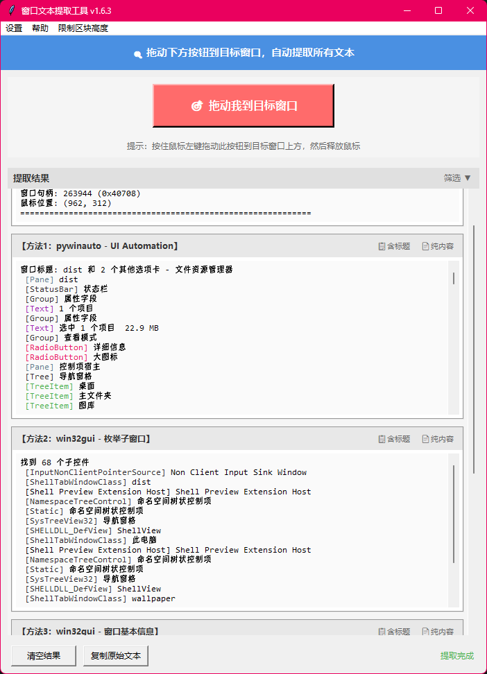

# 🔍 窗口文本提取工具 (Window Text Extractor)

[](https://github.com/LMaxRouterCN/window-text-extractor)
[](https://www.python.org/)
[](LICENSE)

一款通过拖拽定位，快速提取 Windows 窗口内所有文本信息的桌面工具。

 

---
## ✨ 功能特性
- **🎯 拖拽定位**：无需手动输入句柄，按住按钮拖动到目标窗口即可自动识别。
- **📚 多模式提取**：
  - 支持 **pywinauto (UI Automation)** 提取现代 UI。
  - 支持 **win32gui** 枚举子窗口和递归遍历。
  - 自动获取窗口基本信息（句柄、类名、进程ID等）。
- **🎨 语法高亮**：自动识别控件类型（Button, Edit, Text等）并以不同颜色高亮显示。
- **🧩 智能显示**：
  - **动态高度**：文本框自动适应内容长度，无多余空白。
  - **限制模式**：可限制单个区块高度，配合独立的滚动焦点控制，浏览更从容。
- **📋 便捷操作**：
  - 一键复制原始文本。
  - 按区块独立复制（含/不含标题）。
  - 按控件类型筛选文本。
- **🛠️ 自定义配置**：支持自定义不同控件类型的标签颜色。

---

## 🚀 快速开始
### 方式一：直接运行 (推荐普通用户)
1.  前往 [Releases](https://github.com/LMaxRouterCN/window-text-extractor/releases) 页面下载最新的 `窗口文本提取工具.exe`。
2.  双击运行即可，无需安装 Python 环境。
### 方式二：源码运行 (开发者)
1.  **克隆仓库**
    ```bash
    git clone https://github.com/LMaxRouterCN/window-text-extractor.git
    cd window-text-extractor
    ```
2.  **安装依赖**
    建议同时安装以下两个库以获得最佳的提取兼容性：
    ```bash
    pip install pywin32 pywinauto
    ```
3.  **运行程序**
    ```bash
    python window_text_extractor.py
    ```
---
## 📖 使用指南
### 基本操作
1.  启动程序后，界面会置顶显示。
2.  按住 **“🎯 拖动我到目标窗口”** 按钮不放。
3.  移动鼠标到你想提取文本的窗口标题栏或界面上。
4.  松开鼠标，程序将自动提取该窗口下所有可识别的文本。
### 交互细节 (v1.6.3+)
- **高度限制模式**：
  - 默认关闭，所有文本完全展开。
  - 通过菜单栏勾选 **“限制区块高度”** 开启。
  - 开启后，文本框最大显示 15 行。
- **滚动与焦点**：
  - **限制模式关闭**：鼠标在任意位置滚动，均为滚动整体页面。
  - **限制模式开启**：
    - 点击某个文本框可使其**获得焦点**（状态栏提示）。
    - **聚焦后**：滚轮仅滚动该文本框内部内容。
    - **右键点击**：解除焦点，恢复滚动整体页面。
- **颜色设置**：
  - 点击菜单栏 `设置` -> `自定义标签颜色`，可修改 `[Button]`, `[Edit]` 等标签的显示颜色。
---
## 🛠️ 编译打包
如果你想自己修改代码并生成 `.exe` 文件，请遵循以下步骤：
1.  **安装打包工具**
    ```bash
    pip install pyinstaller pillow
    ```
2.  **生成图标 (可选)**
    运行图标生成脚本以获取 `icon.ico`：
    ```bash
    python create_icon.py
    ```
3.  **执行打包命令**
    ```bash
    pyinstaller -F -w --uac-admin --icon=icon.ico --name "窗口文本提取工具" window_text_extractor.py
    ```
4.  生成的文件位于 `dist/窗口文本提取工具.exe`。
---
## ⚠️ 常见问题
1.  **提取不到文本？**
    - 部分使用 DirectX/OpenGL 渲染的游戏窗口或绘画软件可能无法提取文本。
    - 尝试以管理员身份运行本工具。
2.  **启动报错 `ModuleNotFoundError`？**
    - 请确保已安装 `pywin32` 和 `pywinauto`。
    - 如果是 exe 报错，请检查杀毒软件是否误删了依赖文件。
3.  **显示乱码？**
    - 极少数老旧软件使用非 UTF-8 编码，可能导致显示乱码，建议查看“复制原始文本”结果。
---
## 📄 许可证
本项目基于 [MPL 2.0 License](LICENSE) 开源。
